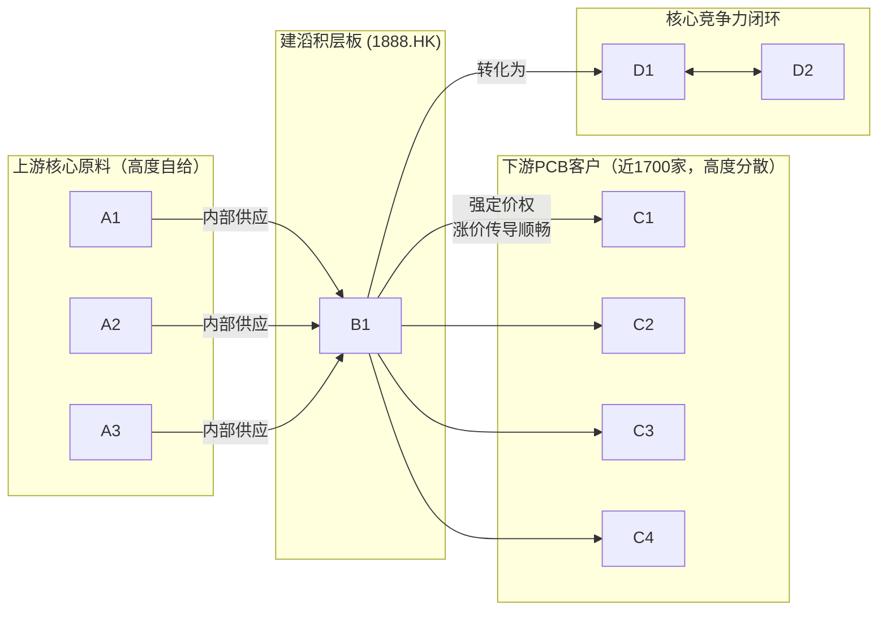
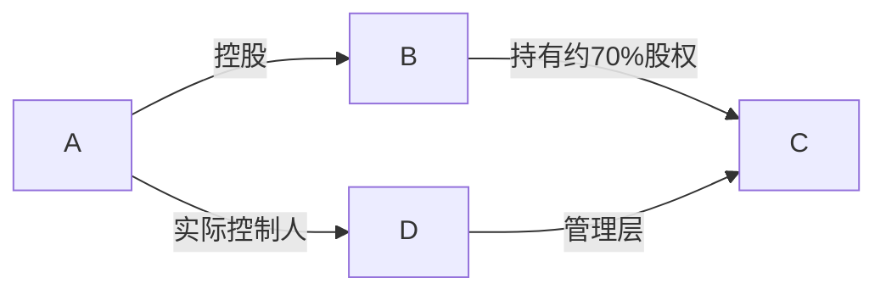

## 公司近况跟踪 20260420

建滔积层板作为全球覆铜板（CCL）龙头，正处在 **“涨价周期兑现盈利弹性+AI材料打开成长空间”** 的双击窗口 。公司自 **2025年下半年以来已累计提价6次，累计涨幅近60%** ，最新一次于 **2026年4月初提价10%** ，盈利弹性持续释放。市场预计公司 **2026年净利润有望达到50亿港元**，乐观预期下可达 **55-60亿港元**，市值已逼近**900亿港元** 。

## 核心投资逻辑

### 短期逻辑

- **CCL持续涨价，盈利弹性确定性高**：受铜箔、玻璃布、环氧树脂等上游原材料价格上涨及下游需求旺盛驱动，覆铜板行业进入明确的涨价周期 。公司凭借行业龙头地位和强大的议价能力，成本传导顺畅。**2026年3月10日** 和 **4月初**，公司连续发布涨价通知，对所有板料及铜箔加工费 **上调10%** 。日本和台湾地区同行亦纷纷提价，印证行业普涨趋势，公司毛利率将直接受益于连续提价，盈利弹性逻辑正在逐步兑现 。

### 长期逻辑

- **全球唯一的垂直一体化产业链构筑深厚护城河**：公司是全球 **唯一** 具备 **“铜箔-环氧树脂-电子布-覆铜板”** 完整产业链的龙头企业 。在原材料价格剧烈波动时，该模式保障了供应链安全与成本控制能力，优势远超同行。例如，在电子布供应紧张、价格上涨的背景下，公司自供比例高，不仅成本可控，外售部分更能直接受益于涨价，盈利能力显著优于竞争对手 。
- **AI驱动高端材料转型，打开第二成长曲线**：公司前瞻性布局AI服务器所需的高端材料，成长接力清晰。
  1.  **高端电子布** ：公司已提前布局低介电（Low DK）电子布产能，广东清远项目已于  **2025年上半年**  投产，产品已成功导入日系、台系头部客户供应链 。 **2026年**  将是关键放量年，预计将再建一个特种纱工厂并投产  **10个窑炉** ，进一步巩固其在AI核心材料领域的领先地位 。
  2. **高速覆铜板** ：**依托在上游高端铜箔（HVLP-3已进入验证）**和电子布的领先优势，公司预计在  **2027-2028年**  实现M6及以上等级的高速覆铜板产品突破，将直接受益于AI服务器、高性能计算等需求的爆发，打开新的增长空间 。

### 催化事件时间表

| 时间             | 事件                                                                                   | 影响                                             |
| -------------- | ------------------------------------------------------------------------------------ | ---------------------------------------------- |
| **2026-02-25** | **发布2025年盈利预喜，预计全年净利润同比增长超80%，达23.9亿港元**               | **明确业绩拐点，验证2025下半年涨价策略的有效性，大幅提振市场信心。**         |
| **2026-03-10** | **官方发布涨价通知，对所有板料、PP及铜箔加工费统一上调10%**                  | **进一步确认行业高景气度和公司的强议价权，直接增厚2026年一季度及以后季度的毛利率。** |
| 2026-04-15     | 市场消息确认公司再次提价，自2025下半年以来累计提价近60%                        | 强化盈利弹性预期，市场开始上修2026年全年盈利预测。                    |
| 2026 H2 (预期)   | 韶关年产7万吨电子纱及9600万米电子布项目投产                               | 进一步提升高端电子布自给率和外销能力，增强在AI材料领域的竞争力。              |
| 2026年内 (预期)    | 新建特种纱工厂及10个窑炉投产                                        | 关键性产能扩张，保障AI驱动下的高端电子布需求，为未来高速CCL产品提供原料基础。      |
| 2027-2028 (预期) | M6及以上等级高速覆铜板产品实现突破并开始放量  | 公司正式切入AI服务器核心材料市场，有望带来估值和盈利的双重提升。              |

## 核心竞争力与护城河

**竞争优势 1：无可比拟的垂直一体化产业链（成本优势 & 供应链安全）**

- **1. 竞争优势分析 (Analysis)**：
  - 优势类型：**成本优势** 与 **产业链卡位**。
  - 性质判定：这是 **结构性优势** 。公司是全球 **唯一** 实现从上游核心原材料（铜箔、环氧树脂、电子布）到下游覆铜板（CCL）全覆盖的企业。
  - 盈利变现路径：该优势主要通过 **更低的单位成本** 和 **更强的供应链稳定性** 转化为财务优势。在原材料涨价周期中，自供模式能有效对冲成本压力，甚至通过外售富余原材料（如电子布）增厚利润；在供应紧张时，能保证自身CCL生产不受影响，抢占市场份额。
  - 优势持续性展望：未来2-3年，随着AI对高端材料一致性和稳定性要求提升，该护城河将持续 **拓宽（强化）**。拥有稳定、高质量的上游材料供应对于高速CCL的研发和生产至关重要，一体化优势将更加凸显。
- **2. 可验证证据 (Evidence)**：
  - **数据支撑**：自 **2025年下半年** 行业进入上行周期以来，公司已连续 **6次** 成功提价，顺畅地将成本压力传导至下游，而多数竞争对手则受困于原材料采购成本的急剧上升 。
  - **事实支撑**：2024年报显示，公司前五大供应商采购额仅占总采购额的 **33%**，而关联方（建滔集团）采购占比仅 **5.5%**，侧面印证了其极高的原材料自给率 。

**竞争优势 2：基于规模和分散客户群的强大定价权（网络效应）**

- **1. 竞争优势分析 (Analysis)**：
  - 优势类型：**网络效应**（广义上，指其市场地位和客户网络带来的优势）。
  - 性质判定：这是 **结构性优势**。作为全球市占率第一的CCL龙头，公司服务着近 **1700家** 高度分散的下游PCB客户 。
  - 盈利变现路径：该优势直接转化为 **更强的提价权**。在供给偏紧时，任何单一客户都缺乏与公司进行价格谈判的筹码，使得公司能率先、有效地实施提价策略，从而获得远高于同行的毛利率弹性。
  - 优势持续性展望：未来2-3年，该护城河将保持 **维持（稳定）**。虽然下游PCB行业集中度可能略有提升，但客户基础的庞大和分散性在短期内难以改变，公司的定价权依然稳固。
- **2. 可验证证据 (Evidence)**：
  - **事件支撑**：**2026年3月10日** 的涨价函为典型案例。在成本驱动下，公司果断发布普涨通知，市场迅速跟进，显示其在行业中的价格引领地位和强大的市场控制力 。

## 公司业务拆分

公司主要从事覆铜面板及其上游物料（如铜箔、玻璃纱、玻璃布、环氧树脂等）的制造和销售，此外还有少量物业投资业务 。

- **业务边际变化**：公司近两年的战略重点是向AI服务器等领域所需的高端材料转型。重点布局的低介电电子纱项目已于 **2025年上半年** 投产，HVLP-3铜箔产品已进入验证周期，后续M6及以上等级的高速覆铜板产品也在推进中，项目进度符合市场预期 。
- **公司盈利方式**：公司的核心盈利模式是通过大规模、一体化的生产获得成本优势，并利用市场龙头地位在行业景气上行时通过提价来扩大利润空间。收费模式为直接的产品销售。公司目前正处于 **需求复苏、成本推动、产品升级** 共同驱动的景气上行周期。
- **分板块业务情况**：
    **表1：分产品收入拆分（百万港元）**

  | 业务板块                 | 2022年      | 占比        | 2023年      | 占比       | 2024年      | 占比       | 趋势判断                       |
  | -------------------- | ---------- | --------- | ---------- | -------- | ---------- | -------- | -------------------------- |
  | **环氧玻璃纤维覆铜板**        | **12,440** | **55.6%** | ≈12,000    | ≈72%     | ≈13,100    | ≈71%     | 核心主业，受益涨价周期                |
  | **纸覆铜板**             | **1,540**  | **6.9%**  | ≈1,200     | ≈7%      | ≈1,300     | ≈7%      | 传统产品，增长平稳                  |
  | **上游物料（铜箔/电子布/树脂等）** | **4,040**  | **18.0%** | ≈2,000     | ≈12%     | ≈2,400     | ≈13%     | 一体化优势核心，外售部分直接受益涨价         |
  | **其他业务（物业/投资/特种树脂）** | **4,340**  | **19.4%** | **1,550**  | **9.3%** | **1,720**  | **9.3%** | 2022年含大额物业交付（31.7亿），此后回归常态 |
  | **合计**               | **22,364** | **100%**  | **16,750** | **100%** | **18,541** | **100%** | —                          |

    *注：2022年详细分产品数据来自中信证券年报点评；2023/2024年覆铜板+上游物料合计数据来自国金证券深度研究，细分为估算值；其他业务数据来自开源证券。*
    **表2：整体毛利率变化与涨价周期对照**

  | 指标        | 2022年     | 2023年     | 2024年     | 2025年     | 2026E   | 2027E   |
  | --------- | --------- | --------- | --------- | --------- | ------- | ------- |
  | **整体毛利率** | **22.9%** | **16.1%** | **17.7%** | **19.6%** | **30%** | **29%** |
  | 毛利润（百万港元） | 5,116     | 2,695     | 3,278     | ≈3,690    | 8,388   | 9,250   |
  | 归母净利率     | 8.5%      | 5.4%      | 7.2%      | ≈12.0%    | 18.0%   | 16.3%   |

    *注：2022-2024年为实际值，2025年为预喜口径（净利23.9亿港元），2026-2027E为国金证券预测。历史涨价周期规律：2014-2017年周期毛利率从22%升至29%，2018-2021年周期毛利率从24%升至34%，当前周期（2024年起）预计毛利率将从18%修复至30%左右。*
    **关键解读**：公司收入结构中，覆铜板（环氧+纸基）占比约70-75%，是绝对主业；上游物料（铜箔、电子布、树脂）外售占比约12-18%，既是利润贡献点也是一体化优势的体现。在涨价周期中，覆铜板涨价直接增厚毛利，同时上游物料涨价也为公司带来额外收益（双重受益）。2022年其他业务占比异常偏高系当年有大额物业交付（31.7亿港元），此后已回归至约17亿港元的常态水平。

## 产销链分析

- **主要客户情况**：公司客户高度分散，拥有近 **1700家** 客户 。**2024年**，前五大客户销售额占总销售额的比例 **低于30%**。最大客户为公司的最终控股公司建滔集团（KHL），销售占比约为 **20%**，这部分为关联交易，主要供给建滔集团旗下的PCB业务 。客户的极度分散化是公司强议价权的基础。
- **主要供应商情况**：公司核心原材料高度自给，对外部供应商依赖度低。**2024年**，前五大供应商采购额占总采购额的 **33%**，最大供应商占比为 **14%** 。这体现了其垂直一体化战略的成功，有效保障了供应链的稳定性和成本控制能力。

## 管理层与公司治理

- **股权结构**：公司实际控制人为 **张国华** 先生及其家族 。最终控股公司为港股上市公司 **建滔集团有限公司（KHL, 0148.HK）**，KHL由 **Hallgain Management Limited** 控制，股权结构稳定 。
- **激励机制**：公司设有购股权重组，**2024年报** 提及向董事及雇员授予购股权重组，但未披露具体的考核目标 。
- **大股东持股变动与减持情况**：
    **控股股东建滔集团（KHL）近5年减持3次**：
  - 2021年1月4日晚间宣布二级配售，融资规模：US$100mn或65mn shares，价格区间：11.81-12.07港元，折价：5%-7%。
  - 2025年7月18日晚间宣布二级配售，大股东配售减持2.5%股份，以扩大上市公司股份的流动性。配售价格在10港元。
  - 2026年3月17日晚间宣布二级配售。根据次日公告，配售价21港元，配售股份1.3亿股。配售前大股东占比71.1%；配售完成后，大股东建滔集团仍持股66.95%。

从2023年中期至2025年中期，建滔集团始终持有约 **23.01亿股（占73.76%）**，持股数量和比例 **完全未变** 。

  **实际控制人张国华家族**方面，张国华、张国强、张国平三兄弟在 **2023年下半年** 各增加了约 **600万股** 间接权益（直接持股不变，推测为通过家族信托调整间接持股结构），此后至2025年中期均 **无任何变动** 。其他董事（张家豪、周培峰、叶澍堃等）在同期也有小幅增持，此后保持稳定。

| 主要股东                                | 持股比例         | 2023H1→2025H1变动 |
| ----------------------------------- | ------------ | --------------- |
| **建滔集团（KHL, 0148.HK）**              | **73.76%**   | **无变化**         |
| Hallgain Management Ltd.（KHL控股方）    | 73.76%（权益重叠） | 无变化             |
| Jamplan (BVI) Ltd.（KHL子公司，直接持股）     | 70.00%       | 无变化             |
| Capital Research and Management Co. | 5.68%        | 无变化             |

  *数据来源：港交所定期报告中的主要股东持股披露。*

## 资本配置与效率

- **现金流去向**：公司现金流主要用于 **再投资（扩产）** 和 **股东回报（分红）**。近年来资本开支明显向高端材料领域倾斜，如投建低介电电子纱窑炉等，以抓住AI市场机遇 。同时，公司保持了良好的分红传统，**2024财年** 建议派发 **每股0.20港元** 的末期股息及 **每股0.30港元** 的特别末期股息，实现成长性与股东回报的平衡 。
- **投入产出比**：公司资本效率显著提升。**净资产收益率（ROE）** 已从 **2023年** 的 **6.07%** 回升至 **2024年** 的 **8.64%**，并进一步提升至 **2025年** 的 **14.94%**，显示公司的扩张是高效的 。
- **产能周期**：公司目前正处于针对高端产品的 **“大额资本开支期”** 和 **“产能爬坡期”** 。随着新产能在 **2026年** 陆续释放，预计将进入新的利润增长阶段。

## 公司财务数据分析

- **过去3年关键财务指标**：

| 财务指标 (单位：亿港元) | 2023       | 2024       | 2025       | 2025年同比       |
| ------------- | ---------- | ---------- | ---------- | ------------- |
| 营业收入          | 155.22     | 175.76     | 188.63     | **+7.32%**    |
| 归母净利润         | 8.42       | 12.58      | 22.59      | **+79.57%**   |
| 毛利率           | **15.98%** | **17.68%** | **19.56%** | **+1.88个百分点** |
| 净资产收益率(ROE)   | **6.07%**  | **8.64%**  | **14.94%** | **+6.30个百分点** |
| 资产负债率         | **36.45%** | **33.49%** | **35.75%** | **+2.26个百分点** |
| 经营活动现金流量净额    | 7.64       | 25.68      | -          | **-**         |

  

*注：财务数据根据参考资料1、31中人民币数据按报告期平均汇率估算为港元，2025年经营现金流数据暂缺。*

- **财务健康状况评估**：
  - **盈利能力强劲复苏**：**2025年** 公司营收和利润均实现显著增长，特别是归母净利润同比 **增长近80%**，主要得益于产品价格上涨和需求回暖 。
  - **利润率持续改善**：毛利率和ROE连续两年提升，显示公司成本传导能力强，盈利质量高。
  - **财务结构稳健**：资产负债率维持在 **35%** 左右的健康水平，为后续的资本开支提供了坚实基础 。
- **ROE拆分**：
ROE的提升主要由 **销售净利率** 的大幅改善驱动。总资产周转率保持平稳，杠杆率稳定。这表明公司盈利能力的提升是内生性的，主要源于主营业务的强劲表现，而非财务杠杆的驱动。

## 公司调研大纲

- **背景**：市场普遍关注本轮涨价周期的持续性、公司在AI高端材料领域的实际进展以及未来的盈利兑现能力。
- **核心问题列表**：
  1.  **涨价与盈利的可持续性** ：
    - 在原材料价格波动的情况下，公司判断本轮CCL涨价周期能持续多久？目前在手订单的毛利率水平如何？是否有信心在 **2026年下半年** 维持或继续提升毛利率？
  2.  **AI高端产品进展与商业化** ：
    - M6及以上等级的高速CCL产品，目前与哪些具体客户进行验证？预计 **何时** 能获得批量订单并产生规模收入？其目标毛利率与传统产品相比有多大提升？
  3.  **产能规划与资本开支** ：
    - **2026-2027年** 详细的资本开支计划是怎样的？新建的低介电电子布产能，计划多少比例用于自供高速CCL，多少比例用于对外销售？
  4.  **下游需求与库存** ：
    - 目前公司在AI服务器、汽车电子、消费电子等主要下游领域的订单能见度分别是多久？是否观察到产业链存在库存回补之外的真实需求增长？

## 盈利预测与估值

- **盈利预测汇总**：

| (单位：亿港元)    | 机构                                     | 2025E     | 2026E      | 2027E     |
| ----------- | -------------------------------------- | --------- | ---------- | --------- |
| **归母净利润**   | 国泰海通证券   | 24.0      | 45.6       | 51.7      |
| &nbsp;      | 中金公司(估)  | -         | 50.0 (中性)  | -         |
| &nbsp;      | 某机构   | 23.9      | 45-50 (中性) | -         |
| &nbsp;      | 国金证券       | 28.0      | 50.0       | 52.0      |
| **一致预期(估)** | **-**                                  | **≈24.0** | **≈48.0**  | **≈52.0** |

  

- **估值分析**：
  - 市场一致预期公司 **2026年** 净利润约为 **48亿港元**。以当前约 **886亿港元** 的市值计算，前瞻市盈率（P/E）约为 **18.5倍** 。
  - 考虑到公司作为全球龙头，在涨价周期中展现出的强大盈利弹性，以及在AI新领域的成长潜力，多家机构认为其估值具备从当前水平修复至 **20-25倍** 区间的潜力 。

## 风险提示

- **下游需求不及预期风险**：若AI服务器、汽车电子等下游领域的需求增长放缓，可能导致CCL行业景气度回落，产品面临价格和销量压力。
- **原材料价格剧烈波动风险**：尽管公司高度垂直一体化，但铜、石油等基础大宗商品价格的极端波动仍可能侵蚀部分利润。
- **高端产品研发及认证风险**：M6+等高速CCL产品的研发、客户认证及市场推广进度存在不确定性，若慢于预期，可能影响公司的长期成长逻辑和估值水平。
- **市场竞争加剧风险**：国内外同行均在积极布局高端CCL市场，未来可能面临更激烈的市场竞争。

&nbsp;