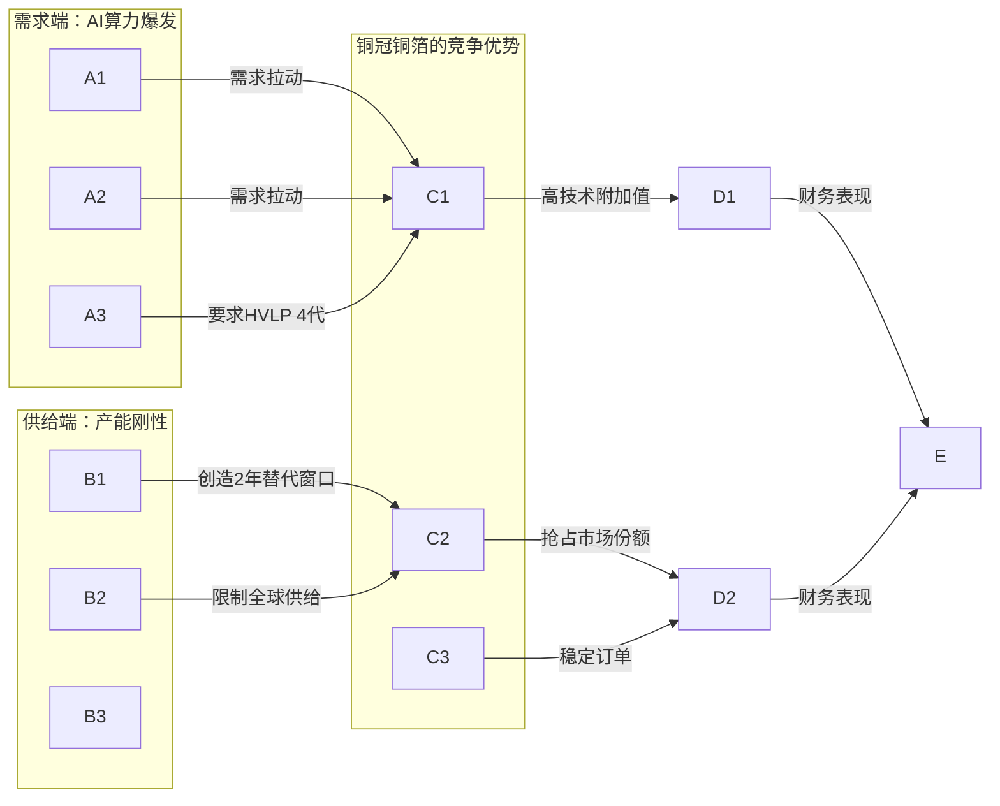
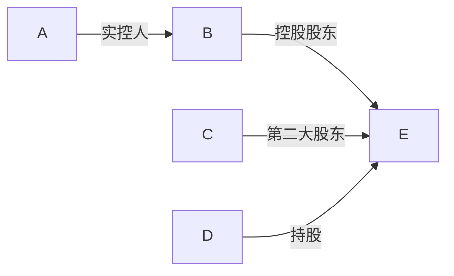

## 公司近况跟踪

铜冠铜箔作为国产 **HVLP（极低轮廓）铜箔** 的领跑者，近期经营重心全面转向AI服务器驱动的高端产品 。公司 **2025年实现扭亏为盈**，归母净利润 **0.63亿元**，同比增长 **140.07%** 。核心亮点在于高端HVLP铜箔销量同比 **+232%**，且 **HVLP 1-4代产品已实现对头部CCL（覆铜板）厂商台光、生益等的批量供货** 。市场普遍预期，随着 **2026年下半年英伟达Rubin平台放量**，AI服务器对更高等阶的HVLP 4代铜箔需求将爆发，公司作为少数具备量产能力的企业将深度受益，盈利弹性巨大 。

## 核心投资逻辑

### 短期逻辑

- **AI铜箔涨价周期开启**：受AI服务器需求爆发及核心设备交付周期长（**2年以上**）的限制，高端HVLP铜箔供给紧张，自 **2025年9月** 起已开启多轮涨价（每轮 **≈15%**）， **2026年4月** 头部CCL厂已同意日本三井全系产品提价 **1.4万元/吨** 。铜冠铜箔作为国内产能最大、进展最快的厂商，将直接受益于涨价带来的盈利弹性 。
- **业绩拐点确认**：公司发布2025年报，实现营收 **66.89亿元（同比+41.75%）**，归母净利润 **0.63亿元（同比+140.07%）**，成功扭亏为盈 。其中，**2025年Q4在铜价上涨导致减值影响下仍实现盈亏平衡**，验证了高端产品占比提升带来的盈利能力修复 。

### 长期逻辑

- **AI服务器迭代驱动下的高端铜箔国产替代**：AI算力竞赛的核心是降低信号传输损耗，这使得对极低粗糙度的HVLP铜箔成为刚需。随着 **2026 H2** AI服务器主力平台（如谷歌、亚马逊）切换至需要HVLP 4代铜箔的新平台，而日台系传统巨头（如三井、古河）扩产缓慢（**新增产能需到2028年**），为铜冠铜箔等国内厂商提供了 **宝贵的2年突破窗口期** 。公司目前HVLP 4代已批量供货，HVLP 5代完成中试送样，技术迭代紧跟全球前沿，有望抢占市场份额 。
- **产品结构升级带来盈利能力跃升**：铜箔的价值量随迭代而指数级提升。普通铜箔吨净利仅数千元，而 **HVLP 2代吨净利约3-4万元**，**HVLP 4代吨净利预计可达10万元** 。公司 **2025年PCB铜箔业务毛利率已提升至6.16%（同比+4.3pct）**，随着更高附加值的HVLP 4代产品放量，盈利能力有望持续大幅改善 。
- **产能优势与客户壁垒**：截至 **2026年初**，公司总产能达 **8万吨/年**，其中PCB铜箔产能 **5.5万吨/年**，是国内AI铜箔产能最大的企业之一 。公司已切入 **台光、生益科技** 等全球头部CCL厂商供应链，客户认证周期长，形成了较强的合作壁垒，能够充分享受下游AIDC（人工智能数据中心）行业发展红利 。

### 催化事件时间表

| 时间           | 事件                                                  | 影响                                                                                                                                     |
| ------------ | --------------------------------------------------- | -------------------------------------------------------------------------------------------------------------------------------------- |
| 2026年3月      | 行业开工率达 **90%**，德福科技、诺德股份等同行对锂电铜箔提价                  | 行业景气度回升，供需格局改善，为电子铜箔进一步涨价提供支撑 。                                                                          |
| 2026年4月      | **日本三井对其全系铜箔产品提价1.4万元/吨，下游台系CCL厂已同意**               | **标志着高端铜箔涨价趋势在全球范围内得到确认，产业链价格传导顺畅，铜冠铜箔等国内厂商有望跟进提价，直接增厚利润** 。                                             |
| 2026年4月17日   | 公司发布2025年年报，归母净利润同比 **+140.07%**，HVLP销量同比 **+232%** | 业绩成功扭亏，高端产品放量得到验证，强化市场对公司基本面反转的信心 。                                                                      |
| 2026年H2 (预期) | **英伟达Rubin平台及谷歌、亚马逊新一代AI服务器开始量产**                   | **新平台将大规模切换至HVLP 4代铜箔，需求将出现结构性爆发，可能加剧供需紧张格局，为铜箔带来新一轮量价齐升** 。               |
| 2026年底 (预期)  | 公司HVLP产能持续扩张                                        | 公司规划将HVLP月出货从 **450-500吨** 提升至 **1000吨** 以上规模，保障AI订单的交付能力 。 |
| 2027年底 (预期)  | 高端铜箔供需紧张有望持续                                        | 考虑到海外厂商扩产周期长，分析师普遍预计本轮由AI驱动的高端铜箔供需紧张将持续到 **2027年底** 。                                                    |

## 核心竞争力与护城河

**竞争优势 1：基于技术卡位与时间窗口的国产替代领先优势**

- **1. 竞争优势分析 (Analysis)**：
  - 优势类型：**技术卡位** 与 **成本优势** 的结合。
  - **性质判定**：这是**阶段性优势**。该优势建立在AI技术浪潮带来的需求突变，以及海外竞争对手扩产缓慢（产能刚性）创造的 **2年时间窗口** 之上 。虽然公司在HVLP 1-4代技术上实现了国产突破，但长期仍需面对海外巨头（如三井）的技术追赶和国内同行的产能扩张竞争。
  - **盈利变现路径**：该优势通过“**提价权**”和“**市占率提升**”双重路径变现。在供不应求的市场中，公司的高端产品（HVLP 4代）享有极高的加工费溢价（**加工费20W/吨，吨净利10W**），带来远高于同行的 **毛利率** 。同时，凭借产能和本土化优势，快速抢占原先日台系厂商垄断的市场份额。
  - **优势持续性展望**：展望未来2-3年，该护城河处于 **拓宽（强化）** 阶段。主要因为AI服务器对高端铜箔的需求仍在高速增长，而供给瓶颈（核心设备）短期难以解决，供需紧张格局将持续到 **2027年底** 。但长期看，随着国内外产能逐步释放，该优势可能 **变窄（被侵蚀）**，届时公司的成本控制和技术迭代能力将成为关键。
- **2. 可验证证据 (Evidence)**：
  - **技术领先性**：公司是国内少数具备 **HVLP 1-4代** 铜箔批量生产能力的企业，**HVLP 4代已批量供货台光电子**，HVLP 5代完成中试并送样，技术迭代速度国内领先 。
  - **市占率数据**：截至2025年底，公司在全球HVLP铜箔市场的出货量市占率已达到 **约20%**，是全球重要的供应商之一 。

## 公司业务拆分

- **公司盈利方式**：公司采用“**原铜+加工费**”的定价模式。收入主要来自PCB铜箔和锂电池铜箔的销售。利润核心来源是“**加工费**”，尤其是在铜价剧烈波动时，加工费的高低和稳定性直接决定了公司的盈利水平。目前公司正处于从依赖传统产品走量向依靠高端产品（HVLP/RTF）提升加工费和毛利率的转型阶段 。
- **分板块业务情况**：公司形成“**PCB铜箔+锂电池铜箔**”双核驱动格局 。
  - **PCB铜箔**：是公司 **当前收入占比最大（2025H1占比57%）**、**过去三年毛利率最高** 的业务板块 。产品覆盖HTE、RTF、HVLP等，主要用于通信、服务器、消费电子和汽车电子领域。**该板块是公司过去三年增速最快的业务**，特别是其中用于AI服务器的 **高频高速铜箔（HVLP/RTF）** 需求旺盛，呈现供不应求态势，是公司未来最核心的增长点 。**2025年，PCB铜箔业务实现营收37亿元，同比增长34%，毛利率为6.16%，同比提升4.31个百分点** 。
  - **锂电池铜箔**：主要产品为4.5μm、6μm等极薄铜箔，用于新能源汽车、3C数码和储能系统 。该业务在过去几年受行业产能过剩、价格竞争激烈影响，盈利能力较弱，**2025年毛利率仅为0.19%** 。但随着行业去产能和需求回暖，以及公司转向5μm及以下高附加值产品，盈利能力已开始修复，**毛利率同比提升了4.85个百分点** 。

**业务板块财务数据汇总**

| 业务板块      | 2023年  | 2024年  | 2025年     | 2026E (预测) | 2027E (预测) |
| --------- | ------ | ------ | --------- | ---------- | ---------- |
| **PCB铜箔** | &nbsp; | &nbsp; | &nbsp;    | &nbsp;     | &nbsp;     |
| 收入 (亿元)   | ≈27.6  | ≈27.6  | **37.0**  | 根据已有信息无法推算 | 根据已有信息无法推算 |
| 收入占比 (%)  | ≈73%   | ≈58%   | **≈55%**  | 根据已有信息无法推算 | 根据已有信息无法推算 |
| 毛利率 (%)   | 1.85%  | 1.85%  | **6.16%** | 根据已有信息无法推算 | 根据已有信息无法推算 |
| **锂电池铜箔** | &nbsp; | &nbsp; | &nbsp;    | &nbsp;     | &nbsp;     |
| 收入 (亿元)   | ≈10.2  | ≈16.6  | **26.2**  | 根据已有信息无法推算 | 根据已有信息无法推算 |
| 收入占比 (%)  | ≈27%   | ≈35%   | **≈39%**  | 根据已有信息无法推算 | 根据已有信息无法推算 |
| 毛利率 (%)   | -4.66% | -4.66% | **0.19%** | 根据已有信息无法推算 | 根据已有信息无法推算 |

*注：2023、2024年数据根据年报中总收入及2025年板块收入同比数据估算。2025年数据来自年报点评。* 

## 产销链分析

- **主要客户情况**：
  - **PCB铜箔**：公司已成功切入 **台光电子、生益科技** 等全球头部的CCL厂商供应链 。这些客户对供应商有严格且漫长的认证周期，一旦进入则合作关系稳定，构成了较强的客户壁垒。**2025年，公司境外收入达到1.8亿元，而去年同期仅0.06亿元**，显示出在海外高端客户拓展方面取得显著突破 。
  - **锂电池铜箔**：主要客户包括 **比亚迪、国轩高科** 等国内主流电池厂商 。其中，第二大股东国轩高科为公司重要客户，**2025年上半年对国轩高科的销售收入占当期锂电铜箔总收入的28.29%**，形成了深度产业链绑定 。
- **主要供应商情况**：
  - 公司核心原材料为阴极铜和铜丝，主要向控股股东 **铜陵有色及其子公司** 采购，形成了稳定的供应链保障 。
  - **供应商集中度较高**，**2024年向铜陵有色及其子公司的采购额占总采购额的比例为60.90%** 。这在保障供应的同时，也使得公司成本受关联方影响较大。
  - 核心生产设备如生箔机、表面处理机等 **高度依赖进口**，是限制公司及行业产能扩张的主要瓶颈之一 。

## 管理层与公司治理

- **股权结构**：
  - 公司的控股股东为 **铜陵有色金属集团股份有限公司**，持股比例为 **72.38%** 。
  - 实际控制人为 **安徽省人民政府国有资产监督管理委员会**，具有深厚的 **国资背景** 。
  - 第二大股东为 **国轩高科**，持股 **2.62%**，形成了产业链上下游的股权绑定 。股权结构稳定。

 -  **激励机制** ：根据已有信息无法推算。 -  **信用记录** ：根据已有信息，公司无明显负面信用记录。

## 资本配置与效率

- **现金流去向**：从现金流量表看，公司近两年经营活动现金流为负，主要因为业务扩张导致营运资金占用增加 。公司现金主要用于 **再投资**，特别是固定资产的构建。**2025年，购建固定资产、无形资产等支付的现金达3.13亿元** 。
- **投入产出比**：**2025年，公司ROIC（投入资本回报率）为1.65%**，净资产收益率（ROE）为 **1.162%** 。虽然仍处于较低水平，但已较2024年的负值有显著改善，显示出随着高端产品放量和盈利能力修复，资本使用效率正在提升。
- **产能周期**：公司目前正处于“**大额资本开支后的产能爬坡期**”。**2024年公司在池州、铜陵两地合计2.5万吨的新产能投产，总产能从5.5万吨提升至8万吨** 。**2025年公司新购置了多台表面处理机以扩充HVLP铜箔产能** 。随着新产能利用率的提升和产品结构优化，预计未来利润将逐步释放。

## 公司财务数据分析

- **关键财务指标**：

| 财务指标 (单位：亿元)        | 2023年  | 2024年  | 2025年      | 2025年同比      |
| ------------------- | ------ | ------ | ---------- | ------------ |
| **营业总收入**           | 37.85  | 47.19  | **66.89**  | **+41.75%**  |
| **归母净利润**           | 0.17   | -1.56  | **0.63**   | **+140.07%** |
| **扣非归母净利润**         | -0.26  | -1.81  | **0.47**   | **+125.81%** |
| **毛利率 (%)**         | 2.34%  | -      | **3.55%**  | **+1.21pct** |
| **净利率 (%)**         | 0.45%  | -3.31% | **0.94%**  | **+4.25pct** |
| **净资产收益率 (ROE, %)** | 0.31%  | -      | **1.16%**  | -            |
| **经营活动现金流量净额**      | -6.00  | -4.65  | **-1.71**  | **+63.10%**  |
| **资产负债率 (%)**       | 19.61% | -      | **29.59%** | **+9.98pct** |

*数据来源：根据提供财务数据整理* 

- **财务健康状况评估**：
  - **盈利能力**：**2025年公司盈利能力显著修复，成功扭亏为盈**。毛利率和净利率均由负转正并实现同比增长，主要得益于高端PCB铜箔业务的放量和锂电铜箔业务的边际改善 。
  - **成长性**：**公司重回高速增长通道**，2025年营收增速超过 **40%**，归母净利润增速超过 **140%** 。
  - **现金流**：**经营性现金流依然为负**，显示公司在快速扩张期对营运资金的需求较大。**2025年末短期负债为8.27亿（上年同期3.32亿）**，财务费用明显增加，需关注后续现金流改善情况 。
  - **偿债能力**：资产负债率从 **19.61%** 提升至 **29.59%**，仍处于行业健康水平，短期偿债风险可控 。

## 公司调研大纲

1. **HVLP 4代及5代铜箔进展与良率**
  - **背景**：市场最关注的焦点是公司在AI铜箔高端产品上的领先身位。HVLP 4代是2026年下半年AI服务器放量的关键，而5代则决定了未来的技术储备。
    - **问题列表**：
      - 目前HVLP 4代产品在台光、生益等核心客户处的 **实际出货量和在手订单规模** 是多少？占HVLP总出货量的比例？
      - HVLP 4代目前的 **生产良率** 处于什么水平？相比日本三井等竞争对手是否存在差距？良率提升的路径和时间表是怎样的？
      - HVLP 5代产品目前送样的客户有哪些？预计 **何时能够完成认证并实现量产**？
2. **产能扩张与产线转产计划**
  - **背景**：供给端的产能是兑现AI订单的基础。公司有大量锂电铜箔产能，市场关心其转产至高利润PCB铜箔的灵活性和成本。
    - **问题列表**：
      - 公司计划在2026年将高频高速铜箔（RTF+HVLP）产量占比提升至 **30%以上**，具体的产能分配和扩产节奏是怎样的？
      - 将锂电铜箔产线切换至PCB铜箔产线的 **实际周期和技改成本** 是多少？目前是否有明确的转产计划？
      - 未来2-3年的 **资本开支计划** 是怎样的？主要投向哪些领域？
3. **价格传导与毛利率展望**
  - **背景**：铜箔行业已经进入涨价周期，但原材料铜价也在上涨。投资者关心公司能否顺利传导成本压力，并将涨价转化为利润。
    - **问题列表**：
      - 面对近期日本三井等厂商的提价，公司的 **跟进提价策略** 是什么？新签订单的加工费水平有多少提升？
      - 考虑到铜价上涨因素，公司预计 **2026年PCB铜箔业务的毛利率** 能达到什么水平？HVLP 4代产品的毛利率能否维持在预期的高位？
      - 公司与下游客户的 **定价周期** 是多久（季度/半年度）？能否有效对冲原材料价格波动风险？

## 盈利预测与估值

分析师普遍看好公司在AI浪潮下的盈利弹性，预测未来两年业绩将实现爆发式增长。

| 预测指标 (单位：亿元)    | 2025A    | 2026E             | 2027E               |
| --------------- | -------- | ----------------- | ------------------- |
| **营业收入**        | 66.89    | 81.65 - 90        | 94.65 - 108         |
| **归母净利润**       | **0.63** | **3.90 - 4.54**   | **5.85 - 7.08**     |
| 归母净利润同比         | +140.1%  | **+519% ~ +620%** | **+49.9% ~ +55.9%** |
| EPS (元)         | 0.08     | 0.47              | 0.71                |
| **PE (对应当前股价)** | -        | **≈67x - 87x**    | **≈46x - 56x**      |

*数据来源：综合分析师一致预期及研报数据* 

**一致预期总结**：
市场一致预期公司 **2026年将是利润释放元年**，归母净利润有望达到 **4.5亿元** 左右，同比增长超过 **6倍**。**2027年** 利润将继续保持 **约50%** 的高速增长。尽管当前看26/27年PE估值较高（**67x/46x**），但考虑到公司在AI高频高速铜箔领域的稀缺性和高成长性，市场愿意给予一定的估值溢价 。

## 风险提示

- **高端铜箔产能释放与认证不及预期**：公司的HVLP 5代铜箔仍处于送样阶段，高端产能扩张依赖进口设备交付与调试，若进度缓慢；或下游CCL大厂的认证周期过长，可能导致公司错失行业涨价的最佳窗口期 。
- **下游AI需求不及预期**：公司的核心增长逻辑建立在AI服务器需求持续高景气的基础上。若未来AI发展速度放缓，或服务器技术路线发生重大变化，将直接冲击对高端铜箔的需求，导致公司业绩增长不及预期 。
- **行业价格竞争加剧**：虽然目前高端铜箔供不应求，但铜箔行业历史上存在较强的周期性。若未来国内外厂商扩产节奏超预期，可能导致市场竞争加剧，高端产品的溢价收窄，对公司毛利率修复进程造成压力 。
- **原材料价格大幅波动风险**：公司产品成本与铜价高度相关。若铜价出现单边大幅上涨，而公司无法及时向下游传导成本压力，将侵蚀公司利润空间，类似 **2025年Q4** 的情况可能重现 。

&nbsp;