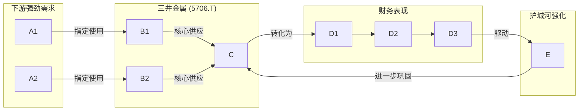

## 公司近况跟踪

三井金属是全球AI服务器核心材料——高端铜箔的绝对龙头，近期经营势头强劲 。公司**2026财年三季报（截至2025年12月）业绩大幅超预期**，核心的工程材料与金属两大业务板块均上调全年利润指引 。受AI需求驱动，公司不仅上调了半导体封装用**MicroThin铜箔**的销售展望，更于**2026年3月宣布对该产品提价10-15%** 。券商（Morgan Stanley）基于其AI材料的龙头地位和未来固态电池材料的潜力，给出**超配**评级，目标价看到 **¥34,500** 。

## 核心投资逻辑

### 短期逻辑

- **AI核心材料持续涨价，直接增厚利润**：当前时间为**2026年4月**，公司在**2026年3月**宣布，对其近乎垄断的半导体封装用**MicroThin铜箔**（全球市占率**约98%**）自**4月**起提价 **10-15%** 。这是继**2025年**对AI服务器用**HVLP铜箔**进行两轮涨价后的又一轮提价动作，充分验证了公司在产业链中的绝对议价能力和下游需求的旺盛程度，提价将直接转化为**2026年二季度**及未来的毛利增长 。
- **业绩超预期及指引上修**：公司于**2026年2月**发布的**三季报**业绩大超市场预期，并大幅上调了**2026财年全年**的利润指引 。其中，铜箔业务对全年经常利润的贡献指引上修了**超过40%**（从**+¥14.8bn**上修至**+¥21.1bn**），金属业务的全年指引更是上修了**近70%**（从**¥36.0bn**上修至**¥61.0bn**） 。强劲的业绩和乐观的指引是支撑当前股价的核心动能。

### 长期逻辑

- **AI浪潮下的“卖铲人”，尽享结构性红利**：三井金属是AI基础设施建设中不可或缺的材料供应商。其两大核心产品：
  1.  **VSP系列（HVLP铜箔）** ：专用于AI服务器高频高速PCB，全球市占率 **高达约80%**  。随着英伟达等巨头不断推出更高性能的GPU，对信号传输损耗要求愈发严苛，VSP铜箔几乎是唯一选择。
  2.  **MicroThin（载体铜箔）** ：专用于DRAM等先进半导体封装，全球市占率 **近乎垄断（约98%）**  。
    AI带来的算力竞赛驱动下游需求持续爆发，而三井金属凭借技术壁垒几乎垄断了高端供给，形成了严重的供需缺口（预计 **2026年** HVLP铜箔月度缺口 **约800吨** ，缺口率 **约36%** ）。公司正积极扩产（HVLP月产能计划从 **2025年初的580吨** 提升至 **2028年的1,200吨** ），量价齐升逻辑清晰，是未来 **1-3年** 最确定的增长驱动力 。
- **下一代电池材料的领先布局，打开第二成长曲线**：公司不仅是当今AI硬件的王者，更是未来新能源技术的重要参与者。公司在**全固态电池**的核心材料——**硫化物固态电解质**领域，与**住友化学**并列为全球技术头部企业，潜在客户包括**丰田**等主流车厂 。此外，其**HRDP（高密度实装基板用材料）**也是面向未来的关键布局。虽然商业化尚需时间，但这一布局为其提供了远超传统有色金属企业的想象空间和估值弹性。Morgan Stanley已将固态电池材料的商业化列为公司的三大核心投资驱动力之一 。
- **稳健的传统金属业务提供安全垫**：公司的金属冶炼业务是传统基本盘，近年来通过加强冶炼网络协同（如提升金、银等副产品回收率），基础盈利能力持续改善，**FY2026基础利润预计同比增长超过30%** 。该业务为公司提供了稳定的现金流，也受益于锌等大宗商品价格上涨，为高增长的材料业务提供了坚实的财务基础和抗风险能力。

### 催化事件时间表

| 时间              | 事件                                                                      | 影响                                            |
| --------------- | ----------------------------------------------------------------------- | --------------------------------------------- |
| 2026年1月         | 举办功能材料事业说明会                                 | 披露铜箔ROIC改善计划和“**2030年铜箔利润翻倍**”的长期愿景，提振市场长期信心。 |
| **2026年2月13日**  | **发布FY2026 Q3财报，业绩超预期并大幅上调全年指引**            | **业绩确定性增强，明确显示铜箔和金属业务增长势头强劲，是股价上涨的核心催化剂。**    |
| **2026年3月**     | **宣布对MicroThin铜箔产品提价10-15%，自4月起生效**         | **再次彰显公司在高端材料领域的定价权，市场预期公司盈利能力将进一步提升。**       |
| 2026年Q2 (预期)    | HVLP铜箔需求恢复高增长                               | 公司预计部分客户的服务器型号切换过渡期结束，VSP铜箔销量有望重回高增长轨道。       |
| 2027年 (预期)      | HVLP铜箔月产能达到 **1,000吨**                      | 关键产能节点，将有效缓解市场供给紧张，并兑现为公司收入和利润的增长。            |
| 2027-2028年 (预期) | 全固态电池材料商业化取得进展  | 若商业化早于预期，将极大提升公司估值水平，打开第二成长曲线。                |

## 核心竞争力与护城河

**竞争优势 1：基于技术专利和工艺诀窍的绝对垄断地位**

- **1. 竞争优势分析 (Analysis)**：
  - 优势类型：**无形资产（专利/技术诀窍）** 与 **产业链卡位**。
  - 性质判定：这是难以逾越的 **结构性优势**。公司在超薄、低损耗电解铜箔领域的技术被Morgan Stanley评价为“**其他公司无法匹敌**” 。这并非简单的先发优势，而是几十年研发投入和工艺积累形成的深厚壁垒。
  - 盈利变现路径：该优势直接转化为 **极强的提价权（高毛利）**。由于在AI服务器和先进封装领域缺乏有效替代品，三井金属能将下游旺盛的需求几乎完全转化为自身利润，表现为多次成功提价，且竞争对手只能跟随 。
  - 优势持续性展望：未来2-3年，随着AI芯片对性能要求越来越高，对铜箔材料的要求也水涨船高，三井金属的护城河预计将持续 **拓宽（强化）**。竞争对手短期内难以在技术和良率上实现追赶。
- **2. 可验证证据 (Evidence)**：
  - **市场份额**：在AI服务器用HVLP铜箔市场占据 **约80%** 份额，在半导体封装用MicroThin铜箔市场占据 **约98%** 的绝对垄断份额 。
  - **定价能力**：**2025年**至今已连续主导多轮行业涨价。最近一次是在**2026年3月**，宣布对MicroThin提价**10-15%**，而行业其他厂商只能被动跟随 。

## 公司业务拆分

- **业务边际变化**：公司近两年的战略重点是全力加码**工程材料业务**，特别是响应AI和半导体市场需求的**高端铜箔**。公司在**2025年内已3次上调HVLP铜箔的增产计划**，目标到**2028年**将月产能提升至**1,200吨**，是**2025年初**的两倍以上 。同时，公司也在积极推进**全固态电池电解质**等下一代材料的研发和商业化，进度符合市场预期 。
- **公司盈利方式**：公司通过四大业务板块盈利。**工程材料**是技术壁垒最高、成长性最强的板块，通过销售技术领先的高附加值产品（如铜箔、催化剂、电池材料）获利，是当前**利润增长最快的核心引擎** 。**金属业务**是传统现金牛，通过锌、铅、贵金属等的冶炼和回收赚取加工费和价差，贡献稳定利润 。**移动出行业务**提供汽车门锁等零部件，受益于汽车行业复苏 。**其他业务**则包含多种专业材料。公司目前正处于由AI驱动的高端材料需求爆发所引领的**高速成长周期**。
- **分板块业务情况**：
根据**FY2026三季报**，工程材料和金属板块是利润的主要贡献者。由于资料未提供各板块详细的收入和毛利率数据，此处根据利润贡献进行分析。

**表1：FY2026 全年利润指引（基于Q3财报上修后）**

| 业务板块                            | FY2026全年利润指引 (亿日元) | 备注                                                                                        |
| ------------------------------- | ------------------ | ----------------------------------------------------------------------------------------- |
| **工程材料 (Engineered Materials)** | **640**            | 全年指引较Q2上修 **+¥115亿**。铜箔业务利润贡献上修至 **+¥211亿**，由销量、价格、产品结构共同驱动 。 |
| **金属 (Metals)**                 | **610 (经常利润)**     | 全年指引较Q2大幅上修 **+¥250亿**。受益于市场环境及内部效率提升（如贵金属回收率提高） 。            |
| 移动出行 (Mobility)                 | 无                  | 根据已有信息无法推算。                                                                               |
| 其他 (Other Businesses)           | 无                  | 根据已有信息无法推算。                                                                               |

*注：以上数据来源于Morgan Stanley对公司FY2026 Q3财报的解读* *。*

## 产销链分析

- **主要客户情况**：公司的高端铜箔产品客户主要是全球头部的**覆铜板（CCL）厂商**和**PCB制造商**，其产品最终用于AI服务器；以及**半导体封装与测试厂商**，其产品用于DRAM等存储芯片。**2025年11月**发生的“爆板事件”中，客户**台光电子**（全球主要CCL供应商之一）要求三井解决问题但并未更换供应商，侧面反映了客户对三井产品的高度依赖和极高的转换成本 。
- **新客户拓展**：资料未提及具体新客户拓展情况，但公司产品作为行业标准，随着AI和半导体行业发展，其客户基础预计将持续扩大。
- **主要供应商情况**：根据已有信息无法推算。
- **经销商情况**：此类高科技工业材料通常采用直销模式，根据已有信息无法推算经销商情况。

## 管理层与公司治理

- **股权结构**：根据已有信息无法推算公司具体的股权结构、实际控制人和持股比例。
- **激励机制**：根据已有信息无法推算。
- **信用记录**：公司历史上无重大负面信用记录。**2025年11月**的“爆板事件”被定性为特定批次的电镀问题，而非系统性质量缺陷，公司正积极解决 。

## 资本配置与效率

- **现金流去向**：公司的现金流配置策略清晰，主要服务于高增长业务的扩张。**FY2025**财年，公司产生了**767亿日元**的强劲经营现金流，其中**334亿日元**用于资本支出（投资现金流为**-209亿日元**），主要投向铜箔等业务的产能扩张 。同时，**-436亿日元**的融资现金流表明公司在利用经营所得进行债务偿还或股东回报 。
- **投入产出比**：虽然没有直接的ROIC数据，但公司在**2026年1月**的说明会中明确提出了**铜箔业务ROIC改善计划**和**2030年利润翻倍**的愿景，显示管理层对资本回报效率的重视 。
- **产能周期**：公司正明确处于针对高端铜箔的 **“大额资本开支期”** 和 **“产能爬坡期”** 。随着新产能在未来几年陆续释放，预计将进入折旧稳定后的“利润释放期”。

## 公司财务数据分析

- **过去3年关键财务指标**：

**表2：公司关键财务指标（单位：亿日元）**

| 财务指标       | FY2023 (截至2023/3/31) | FY2024 (截至2024/3/31) | FY2025 (截至2025/3/31) | FY2025同比     |
| ---------- | -------------------- | -------------------- | -------------------- | ------------ |
| 营业收入       | 6,520                | 6,467                | **7,123**            | **+10.1%**   |
| 营业利润       | 125                  | 317                  | **747**              | **+135.6%**  |
| 总资产        | 6,319                | 6,406                | **6,579**            | **+2.7%**    |
| 总负债        | 2,215                | 2,030                | **1,681**            | **-17.2%**   |
| 股东权益       | 2,614                | 2,860                | **3,409**            | **+19.2%**   |
| 经营活动现金流量净额 | 430                  | 753                  | **767**              | **+1.9%**    |
| 资产负债率      | 35.0%                | 31.7%                | **25.6%**            | **-6.1个百分点** |

*注：数据来源于Yahoo Finance，财年（FY）指截至次年3月31日的年度* *。*

- **财务健康状况评估**：
  - **盈利能力爆发式增长**：**FY2025**财年，公司营业利润同比**增长135.6%**，盈利能力实现强劲复苏和增长，远超营收增速，主要得益于产品结构优化和盈利能力强的业务占比提升 。
  - **资产负债表持续优化**：公司在扩大经营的同时，负债总额显著下降，资产负债率从**35.0%优化至25.6%**，财务结构非常健康，为未来的持续投资和抵御风险提供了坚实基础 。
  - **现金流充裕**：经营性现金流连续两年保持在**超过750亿日元**的高位，造血能力强劲 。
- **ROE分析**：根据TTM稀释EPS **¥817.60**和**5,717.5万**股本计算，TTM归母净利润约为**467.5亿日元**。基于FY2025年末**3,409亿日元**的股东权益，估算公司当前ROE约为 **13.7%**。ROE的提升主要由利润率的大幅改善驱动。

## 公司调研大纲

- **背景**：市场高度关注公司在AI驱动下，其核心铜箔业务的增长持续性、技术壁垒的稳固性以及新业务的商业化前景。
- **核心问题列表**：
  1.  **HVLP铜箔的供需与竞争格局** ：
    - 公司如何看待**2026-2027年**HVLP铜箔的真实供需缺口？考虑到**德福科技、铜冠铜箔**等中国厂商的追赶，公司判断其 **约80%** 的市场份额能否在未来2-3年内保持稳定？
  2.  **MicroThin铜箔的增长驱动力** ：
    - 除了DRAM等传统应用，驱动MicroThin铜箔销售展望上调和**+5%**环比增长的新需求具体来自哪些半导体领域？此轮**10-15%**的提价，下游客户的接受程度如何？
  3.  **全固态电池材料的商业化路径** ：
    - 公司硫化物固态电解质当前的产能、成本和良率水平如何？除了与**丰田**的潜在合作，是否已有其他车厂或电池厂进入实质性验证阶段？预计**何时**能够贡献规模化收入？
  4.  **盈利能力与资本开支** ：
    - 随着价格提升和产品结构优化，公司预计铜箔业务的毛利率目标在什么水平？**FY2027**金属冶炼业务的定期检修（预计影响**¥40亿**利润）是否会对集团整体的资本开支和分红计划产生影响？

## 盈利预测与估值

- **盈利预测汇总**：
根据Morgan Stanley在**2026年2月13日**的预测 ：

**表3：Morgan Stanley盈利预测**

| 指标                 | 2027财年预测 (FY3/27E) |
| ------------------ | ------------------ |
| 每股收益 (EPS)         | **¥1,577**         |
| 目标价 (Price Target) | **¥34,500**        |

- **估值分析**：
  - Morgan Stanley采用分部估值法（SOTP），给予高增长、高壁垒的**铜箔业务29.5倍PE**，给予其他业务（主要是金属和移动出行）与行业平均一致的**15.0倍PE**，最终得出公司的合理混合估值为 **22.0倍PE** 。
  - 基于其预测的**2027财年EPS ¥1,577**，乘以**22.0倍PE**，得出目标价 **¥34,500** 。
  - 当前公司TTM市盈率为**44.64倍** ，远高于券商给出的远期估值，反映了市场对公司未来几年高速增长的极高预期。估值中包含了对AI需求持续爆发和新材料业务商业化的期权价值。

## 风险提示

- **AI服务器需求不及预期风险**：公司的核心增长逻辑建立在AI需求持续爆发之上。若全球超大规模数据中心的资本开支增速放缓，将直接冲击对HVLP铜箔的需求，导致公司业绩和估值双杀 。
- **技术领先地位被侵蚀的风险**：目前国产替代厂商（如铜冠铜箔、德福科技）正在加速追赶 。尽管短期内难以撼动三井的地位，但若其技术突破速度超预期，可能导致市场竞争加剧，侵蚀三井的市场份额和定价权。
- **估值过高风险**：公司股价在过去一年上涨**近10倍**，当前TTM市盈率处于历史高位 。高估值本身已包含了极高的增长预期，任何业绩不及预期、需求放缓或竞争加剧的迹象都可能引发股价大幅回调。
- **大宗商品价格波动风险**：公司的金属业务利润与锌、铅、铜等金属价格密切相关，大宗商品价格的剧烈下跌将影响该部分业务的盈利能力 。
- **新业务商业化不确定性风险**：全固态电池、HRDP等新材料业务虽然想象空间巨大，但其商业化量产的时间表、技术路径和最终盈利能力仍存在较大不确定性 。

&nbsp;