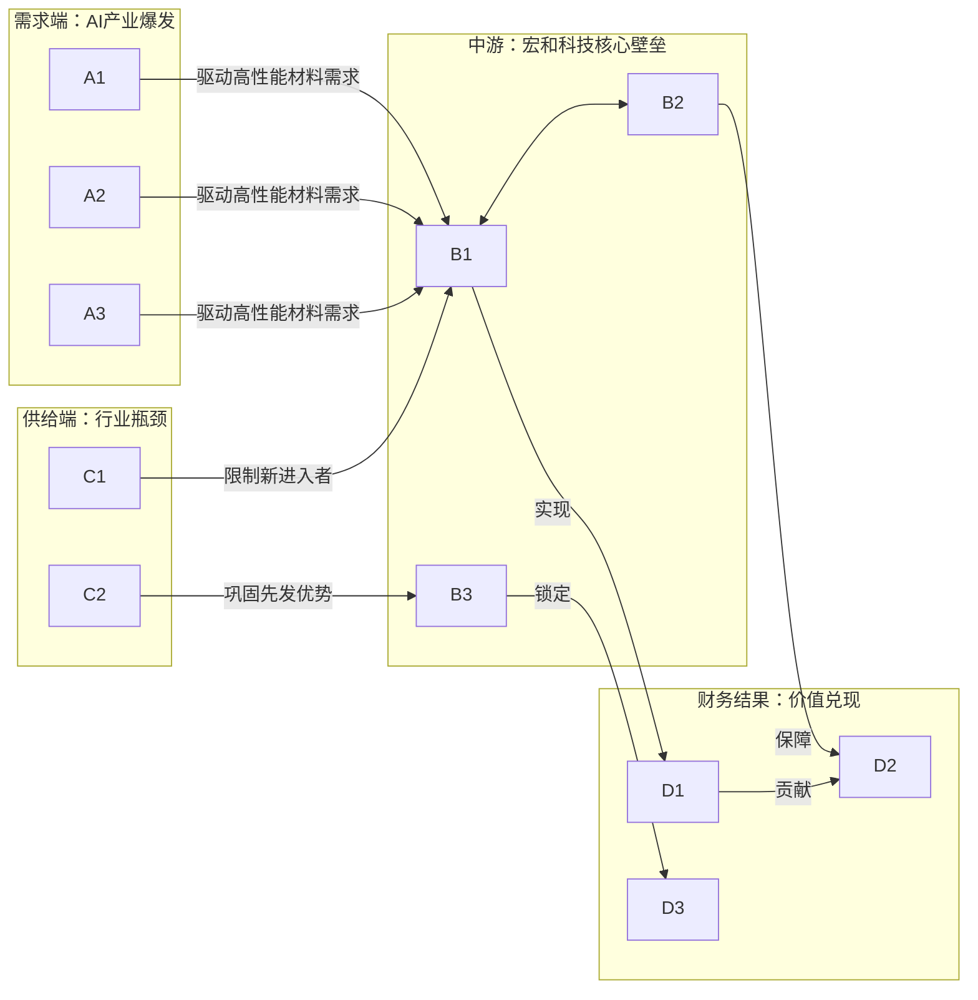
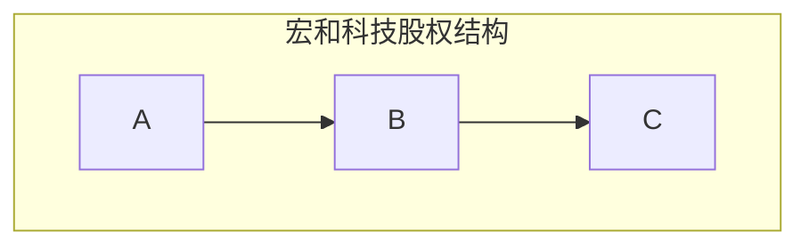

## 公司近况跟踪 20260420

宏和科技近期经营表现强劲，**2026年第一季度业绩**，实现营业收入 **4.42亿元** （同比增长 **+79.72%**），归母净利润 **1.40亿元** （同比增长 **+354.22%，其实略低于市场预期，但预期不断下修，同时投资者去看全年的预期还是保持很高**） 。业绩爆发的核心驱动力源于AI服务器等下游需求旺盛，导致公司主营的高端电子布产品，尤其是**高性能特种电子布**，呈现**量价齐升**的态势，综合毛利率大幅提升至 **55.65%** 。公司正处于大规模产能扩张阶段，以满足远超现有产能的客户订单 。

## 核心投资逻辑

### 短期逻辑

- **业绩与价格双重催化**：公司于 **2026年4月16日** 披露的**一季报业绩** 极其亮眼，归母净利润同比大增 **354.22%**，环比增长 **122%**，验证了行业高景气度向公司业绩的有效传导 。同时，电子布行业自 **2026年初** 以来已开启多轮涨价，主流型号 **7628** 电子布价格持续上行，而公司主导的**高性能特种布** 涨价幅度更为显著，部分客户的旧订单甚至被作废并要求按新价格重签，显示了公司极强的议价能力 。这一“量价齐升”的局面预计在短期内仍将持续，为股价提供强劲支撑。
- **行业供需极度紧张**：AI算力需求爆发导致上游高端电子布供给严重不足。核心瓶颈在于织布机产能受限（主要供应商日本丰田订单已排至 **2028年**），导致行业扩产周期长 。宏和科技凭借与丰田的战略合作，设备交付周期优于同行，能更快响应市场需求 。当前行业专家测算 **LowDk/Df** 布月度需求缺口巨大，预计紧张态势将持续至 **2027年底**，短期内供给无法满足需求，为公司产品价格和出货量提供了坚实保障 。

### 长期逻辑

- **AI驱动的高端电子布需求结构性爆发**：AI服务器、交换机以及高端消费电子（如BT载板）对PCB材料提出了更高要求，驱动电子布向**低介电 (Low DK)**、**低热膨胀系数 (Low CTE)** 等高性能方向迭代 。宏和科技是国内极少数掌握相关核心技术并实现大规模量产的企业，成功打破日系厂商的长期垄断 。随着AI产业的长期发展，对高端电子布的需求将是结构性而非周期性的增长，公司作为核心上游材料供应商，将深度受益于整个产业链的价值提升。
- **“纱-布”一体化构筑成本与供应链护城河**：公司通过子公司黄石宏和实现了**高端电子纱**的自主生产，打通了“纱-布”一体化的产业链 。这一布局不仅能在上游原材料紧缺时保障自身供应链的安全与稳定，还能有效控制成本、协同研发，提升产品品质和盈利能力。在当前全行业面临供给瓶颈的背景下，一体化生产的战略优势尤为突出，是公司区别于其他织布厂商的核心竞争力之一 。
- **产能扩张与客户卡位，国产替代龙头地位强化**：面对远超产能的下游订单，公司正积极进行产能扩张。通过 **2025年** 完成的 **A股定增** 和正在推进的 **港股IPO**，公司获得了充足的资金支持，用于黄石基地的大规模扩产，目标在 **2026年底** 和 **2027年底** 将高性能产品月出货量分别提升至 **200万米** 和 **300万米** 。同时，公司已成功切入全球核心服务器、BT载板及消费电子头部客户（A客户）供应链，国产替代空间广阔。持续的产能释放将帮助公司抓住市场机遇，稳固并提升其在全球高端电子布领域的市场份额 。

### 催化事件时间表

| 时间              | 事件               | 影响                                                                                                                                                                                                                                       |
| --------------- | ---------------- | ---------------------------------------------------------------------------------------------------------------------------------------------------------------------------------------------------------------------------------------- |
| 2026年2月-4月      | **电子布行业连续提价**    | 普通电子布及特种电子布价格持续上涨，直接提升公司营收和毛利率水平，强化市场对公司盈利能力的预期 。                                                                                                                                |
| 2026年4月10日      | **发布2025年年报**    | 2025年归母净利润同比增长 **785.55%**，其中特种电子布收入增长 **13倍**，毛利率高达 **61.31%**，明确了公司增长的核心驱动力，提振市场信心 。 |
| 2026年4月16日      | **发布2026年一季报**   | **营收和净利润均实现超预期高增长**，归母净利润同比大增 **354.22%**，验证了行业高景气和公司成长逻辑，成为股价上涨的直接催化剂 。                                                                             |
| 2026年H2 (预期)    | 新增产能逐步落地         | 公司黄石基地新产能预计在年底开始逐步释放，有望实现高性能电子布销量的快速提升，将业绩增长从“价增”逻辑扩展至“量价齐升”逻辑 。                                                                                                                                             |
| 2026-2027年 (预期) | 香港IPO进程推进        | 公司推进港股IPO为后续更大规模的产能扩张储备资金，若成功上市，将进一步打开融资渠道，加速抢占全球市场份额 。                                |
| 持续              | **AI及消费电子新产品发布** | 谷歌、英伟达等终端厂商发布新一代AI芯片或手机厂商发布新旗舰机型，将持续拉动对上游Low CTE、Low DK等高性能电子布的需求，强化公司产品的长期需求逻辑 。                                                   |

## 核心竞争力与护城河

**竞争优势 1：高端特种电子布的技术与客户卡位壁垒**

- **1. 竞争优势分析 (Analysis)**：
  - 优势类型：**无形资产（专利/know-how）** 与 **产业链卡位**。
  - **性质判定**：这是**结构性优势**。高端电子布（尤其是Low CTE布）的研发周期长、工艺复杂、良率控制难度大，且需要与下游顶级CCL（覆铜板）厂和终端厂商（如苹果、服务器巨头）进行长期深度合作与认证，形成了极高的进入壁垒。公司经过多年研发，是国内少数能量产并稳定供应的企业，成功打破了日系厂商的垄断 。
  - **盈利变现路径**：该优势直接转化为**极强的提价权**和**高毛利**。在AI需求驱动下，高端产品供不应求，公司拥有绝对的定价话语权。财务上体现为特种电子布业务的毛利率远超行业平均，2025年高达 **61.31%**，2026年一季度进一步提升至 **65%** 。
  - **优势持续性展望**：未来2-3年，该护城河将持续**拓宽（强化）**。AI技术仍在高速迭代，对材料性能的要求只增不减。同时，核心生产设备（织布机）供给受限，新进入者难以快速形成有效产能，而公司已与设备商建立战略合作，能够优先扩产，进一步巩固其领先地位 。
- **2. 可验证证据 (Evidence)**：
  - **盈利能力**：2025年公司特种电子布业务毛利率为 **61.31%**，而传统的E玻璃纤维布毛利率为 **31.44%**，优势显著 。
  - **客户认证**：公司低介电产品已通过**斗山电子、台光电子、松下电子、台燿科技**等全球头部CCL厂商认证，并已进入服务器和头部消费电子（BT载板）供应链 。

**竞争优势 2：基于“纱-布一体化”的供应链掌控力与成本优势**

- **1. 竞争优势分析 (Analysis)**：
  - 优势类型：**成本优势** 与 **供应链卡位**。
  - **性质判定**：这是**结构性优势**。通过黄石基地的自产高端电子纱，公司向上游延伸，打通了产业链。这不仅能保证在原材料紧缺时核心物料的稳定供应，避免被上游“卡脖子”，还能通过内部协同优化纱线配方与织布工艺，实现更优的成本控制和更高的产品良率。
  - **盈利变现路径**：该优势主要转化为**更低的单位成本**和**更稳定的现金流**。自产纱线降低了采购成本和交易成本，提升了整体毛利率。稳定的供应链也意味着更强的订单交付能力，从而获得客户信赖，带来稳定的经营性现金流。黄石宏和子公司在 **2025年** 已实现盈利，证明了一体化战略的成功 。
  - **优势持续性展望**：未来2-3年，该护城河将持续**拓宽（强化）**。随着公司高性能产品产能的扩张，对上游高品质纱线的需求将同步放大，一体化布局的规模效应和成本优势将更加凸显，进一步拉开与单纯织布厂商的差距。
- **2. 可验证证据 (Evidence)**：
  - **一体化协同效应**：公司在交流中明确提到，结构优化带动了黄石宏和（高端纱线子公司）从 **2025年** 开始盈利，并保障了整体运营的安全稳定 。在原材料玻纤纱采购均价同比上涨 **+206.55%** 的情况下，公司整体毛利率依然能实现同环比显著提升，一体化优势功不可没 。

## 公司业务拆分

- **业务边际变化**：公司近年来的战略重心已明确从传统的E-glass电子布全面转向**高性能特种电子布**。**2025年** 是公司高性能产品（低介电电子布、低热膨胀系数电子布）的放量元年，当年已开始批量生产并交付，收入从几乎为零暴增至 **1.78亿元** 。进入 **2026年**，这一趋势正在加速，公司主动控制普通薄布接单，将有限的织布机产能优先分配给毛利更高的特种布，产品结构持续高端化，完全符合公司预期 。
- **公司盈利方式**：公司是高端电子级玻璃纤维布的专业制造商，通过“以销定产”的模式为下游覆铜板（CCL）厂商提供关键基材。盈利主要来源于电子布的销售收入与原材料（主要是电子纱）成本之间的价差。随着公司业务结构向高附加值的特种电子布倾斜，其盈利能力已不再依赖于传统产品的规模效应，而是更多地来自于**技术溢价和产品稀缺性带来的超额利润** 。
- **分板块业务情况**：
  - **电子级玻璃纤维布**：**此业务是公司最主要的收入和利润来源，占2025年总收入的95.5%** 。该板块内部结构变化剧烈：
    - **特种电子布**：主要包括低介电、低热膨胀系数等高性能产品，应用于AI服务器、高端芯片封装（BT载板）等前沿领域。**这是公司过去三年增速最快、毛利率最高的业务**。2025年实现收入 **1.78亿元**，同比暴增 **+1,327%**，毛利率高达 **61.31%** 。
    - **E玻璃纤维布**：主要为传统的超薄、极薄布，应用于消费电子、汽车电子等领域。2025年实现收入 **9.4亿元**，同比增长 **+23%**，毛利率为 **31.44%** 。
  - **电子纱**：公司产业链上游环节，主要为自产自用，部分对外销售。2025年实现收入 **0.46亿元**，同比下降 **-13.58%**，毛利率为 **24.06%** 。
    下表汇总了各业务板块的经营数据：

| 业务板块         | 2025年收入 (亿元) | 2025年收入占比 | 2025年毛利率   | 业务描述与地位                |
| ------------ | ------------ | --------- | ---------- | ---------------------- |
| **电子级玻璃纤维布** | **11.19**    | **95.5%** | **36.21%** | **公司核心业务**             |
| - 特种电子布      | 1.78         | 15.2%     | **61.31%** | **增长核心驱动力，技术壁垒高，毛利最高** |
| - E玻璃纤维布     | 9.40         | 80.3%     | 31.44%     | 传统优势业务，受益行业景气回升        |
| **电子纱**      | 0.46         | 3.9%      | 24.06%     | 产业链上游，保障自用为主           |
| **其他业务**     | 0.06         | 0.5%      | 4.82%      | /                      |
| **合计**       | **11.71**    | **100%**  | **35.57%** | /                      |

数据来源: 

## 产销链分析

- **主要客户情况**：公司的直接客户为下游覆铜板（CCL）厂商。公司低介电产品已通过全球头部CCL厂商的认证，包括**斗山电子、台光电子、松下电子、台燿科技**等 。通过这些CCL厂，公司的产品最终应用于服务器、BT载板、消费电子、存储、芯片等领域 。**2025年**，公司成功进入**服务器供应链**，并于年底切入**消费类电子芯片（BT载板）领域**，显示其在高端市场的突破 。公司也在积极拓展直接与终端大客户的合作，例如已进入**A客户供应链**，打破了原日系供应商的独家供应格局 。
- **在手订单和新签订单**：当前公司高性能产品的**在手订单量远大于产能** 。市场需求极为旺盛，甚至出现了公司单方面作废旧订单，要求客户按新价格重新签订合同的情况，这充分反映了公司在产业链中的强势地位和产品的紧缺程度 。订单的终极驱动力来自全球AI算力的军备竞赛和电子产品性能升级的持续需求。
- **主要供应商情况**：公司最关键的外部供应瓶颈是生产高端电子布所必需的**织布机**，其核心供应商为日本丰田公司。全球织布机产能紧张，丰田的订单已排至 **2028年** 。但宏和科技已与**日本丰田签订战略合作协议**，能够获得 **6-7个月** 的优先交付期，相比同业具有明显优势，保障了其扩产计划的可行性 。对于另一核心原材料电子纱，公司通过黄石宏和的“纱-布一体化”布局，已实现大部分高端纱线的自给自足，降低了对外部供应商的依赖 。

## 管理层与公司治理

- **股权结构**：根据公开信息，公司的实际控制人信息在所提供的资料中未明确提及。
- **激励机制**：资料中未提及公司近期的股权激励计划。
- **信用记录**：从现有资料看，公司管理层战略清晰，聚焦主业，积极通过A股定增、筹划港股IPO等资本运作来支持产能扩张和技术研发，未发现有损害投资者利益的不良记录 。

## 资本配置与效率

- **现金流去向**：公司的现金流主要用于**再投资**，特别是大规模的资本开支。**2025年**，公司投资活动现金流净流出 **7.9亿元** 。**2026年第一季度**，仅购建固定资产、无形资产等长期资产所支付的现金就高达 **4.1亿元** 。这表明公司正将经营所得和外部融资（如定增募集的 **9.95亿元**）迅速转化为产能，以抓住当前的市场机遇 。
- **投入产出比**：公司的资本效率正在快速提升。**ROE** 已从2024年的 **1.59%** 大幅跃升至2025年的 **13.03%** 。随着高毛利的特种布收入占比持续提高，以及新产能的利润释放，预计公司的ROIC和ROE将进入快速上升通道。
- **产能周期**：公司目前明确处于“**大额资本开支期**”和“**产能爬坡期**”。黄石基地正在建设新厂房，大量设备正在采购和安装过程中，预计 **2026年底** 开始将有显著的新增产能释放，并在 **2027-2028年** 持续爬坡 。

## 公司财务数据分析

- **历史财务指标**：

| 财务指标 (单位：亿元)        | 2023年  | 2024年  | 2025年  | 2025年同比       |
| ------------------- | ------ | ------ | ------ | ------------- |
| **营业总收入**           | 6.61   | 8.35   | 11.71  | **+40.31%**   |
| **归母净利润**           | -0.63  | 0.23   | 2.02   | **+785.55%**  |
| **扣非归母净利润**         | -0.86  | 0.05   | 1.96   | **+3542.90%** |
| **毛利率 (%)**         | 8.83%  | 17.37% | 35.57% | **+18.2 pp**  |
| **净利率 (%)**         | -9.54% | 2.73%  | 17.24% | **+14.51 pp** |
| **净资产收益率 (ROE, %)** | -4.42% | 1.57%  | 12.24% | **+10.67 pp** |
| **经营活动现金流净额**       | -0.98  | 1.79   | 2.94   | **+63.69%**   |
| **资产负债率 (%)**       | 43.65% | 42.20% | 49.74% | **+7.54 pp**  |

数据来源: 

- **财务健康状况评估**：
  - **盈利能力**：公司在 **2025年** 实现了根本性的扭转，盈利能力爆发式增长。毛利率和净利率均大幅提升，核心原因是高附加值产品放量和产品价格上涨 。**2026年第一季度**，毛利率更是跃升至 **55.65%**，盈利能力再上新台阶 。
  - **成长性**：营收和利润增速惊人，特别是扣非归母净利润增速超过 **35倍**，显示增长完全由主营业务驱动 。
  - **现金流**：经营性现金流健康，**2025年** 同比增长 **+63.69%**，为公司的扩张提供了有力支持 。
  - **偿债能力**：资产负债率维持在 **50%** 以下，处于合理水平。考虑到公司正在进行大规模资本开支，负债率小幅上升是正常现象 。
- **ROE拆分**：**2025年ROE** 的大幅提升主要由**销售净利率**的急剧改善驱动。在总资产周转率和权益乘数相对稳定的情况下，销售净利率从 **2.73%** 飙升至 **17.24%**，是ROE增长的核心原因，这背后反映的是公司产品结构优化和议价能力增强带来的盈利质变。

## 公司调研大纲

1. **产能扩张与设备交付的确定性**
  - **背景**：公司计划在2026年底和2027年底实现200万米/月和300万米/月的高性能产品出货目标，而核心设备丰田织布机全球供应紧张。
    - **问题**：
      - 公司与丰田的战略合作协议具体能确保多少台织布机在未来两年的交付？是否存在延迟风险？
      - 黄石新厂房的建设进度是否符合预期？预计2026年下半年能贡献多少实际产量？
2. **高性能产品价格趋势与可持续性**
  - **背景**：2026年一季度高性能产品已提价 **20%**，市场供不应求。
    - **问题**：
      - 公司判断本轮高端电子布的涨价周期能持续多久？2026年下半年是否还有进一步提价的空间和计划？
      - 在当前价格下，Low CTE、Low DK一代、Low DK二代等不同产品的毛利率具体在什么水平？
3. **核心客户渗透与份额目标**
  - **背景**：公司已切入服务器、BT载板及A客户供应链。
    - **问题**：
      - 公司在A客户BT载板材料中的份额目标是多少？预计何时能成为其主要供应商？
      - 在AI服务器领域，公司产品主要通过哪些CCL厂供应给哪些终端客户？预计2026年服务器业务占特种布收入的比重能达到多少？
4. **竞争格局与技术演进**
  - **背景**：中材科技、国际复材等国内对手也在布局高端电子布，同时行业存在技术迭代风险。
    - **问题**：
      - 相较于国内主要竞争对手，公司在Low CTE和Low DK产品的技术、良率和成本方面有何具体优势？
      - 公司对下一代电子布技术（如更低介电常数、石英布等）有何研发布局？如何应对潜在的技术路线变更风险？
5. **港股IPO进展与资金用途**
  - **背景**：公司已公告计划推进港股IPO。
    - **问题**：
      - 目前港股IPO的进展到了哪个阶段？预计的时间表是怎样的？
      - 此次IPO募集的资金，在已规划的黄石项目之外，是否有更远期的产能或研发投资计划？

## 盈利预测与估值

| 指标             | 券商                                                                                  | 2025A | 2026E | 2027E | 2028E |
| -------------- | ----------------------------------------------------------------------------------- | ----- | ----- | ----- | ----- |
| **营收 (亿元)**    | 国联民生       | 11.7  | 22    | 35    | 44    |
| &nbsp;         | 一致预期     | 11.66 | 21.10 | 34.10 | /     |
| **归母净利润 (亿元)** | 国联民生       | 2.0   | 6.2   | 11.9  | 15.5  |
| &nbsp;         | 东莞证券       | 2.02  | /     | /     | /     |
| &nbsp;         | 一致预期     | 2.09  | 5.07  | 9.39  | /     |
| **EPS (元)**    | 国联民生       | 0.23  | 0.69  | 1.32  | 1.72  |
| &nbsp;         | 东莞证券(调整后)  | 0.23  | 0.60  | 1.18  | /     |
| &nbsp;         | 中国银河                                                                                | 0.23  | 0.40  | 0.62  | /     |
| &nbsp;         | 一致预期     | 0.23  | 0.56  | 1.04  | /     |

- **一致预期总结**：市场普遍预期公司在 **2026年** 和 **2027年** 将迎来业绩的持续爆发式增长。综合多家券商预测，预计公司 **2026年** 归母净利润将达到 **5-6亿元** 水平，同比增长 **150%-200%**；**2027年** 归母净利润有望冲击 **10亿元** 大关。虽然当前估值水平相对较高，但考虑到公司在AI核心材料领域的稀缺性和极高的业绩弹性，市场愿意给予高成长性溢价 。

## 风险提示

- **下游需求不及预期风险**：如果AI服务器建设或高端消费电子市场复苏不及预期，可能影响对上游高性能电子布的需求量，导致公司订单和收入增长放缓 。
- **行业竞争加剧风险**：国内外竞争对手可能加速技术突破或产能扩张，若未来行业供给大幅增加，可能导致产品价格竞争加剧，侵蚀公司利润率 。
- **技术迭代风险**：电子材料技术发展迅速，若出现颠覆性的新材料或技术路线，可能导致公司现有产品和技术优势被削弱。
- **产能扩张与管理风险**：公司正进行大规模资本开支和产能建设，可能面临项目延期、成本超支、新增产能消化不及预期以及规模扩张带来的管理挑战。
- **客户集中度较高风险**：公司对部分下游大客户存在一定依赖，若主要客户的采购策略发生变化，可能对公司经营产生不利影响 。

&nbsp;